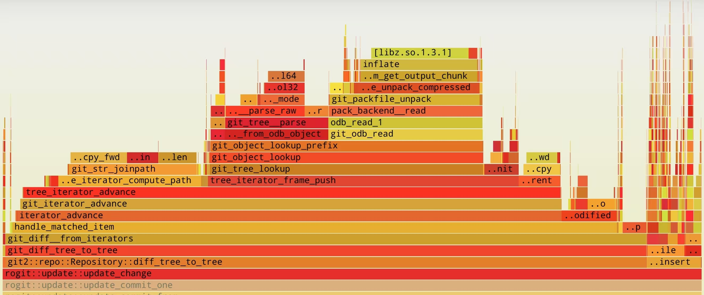

# Git 很慢

> 2025 年 1 月 23 日 抱怨一下 Git 的数据结构
>
> 2025 年 4 月 13 日 后续：ROGit 改名为 [Bushi 卜筮](https://github.com/qaqland/bushi)，基本解决了这个问题，其余部分还在做

一年半之前，我有一个 ROGit 项目计划，旨在构建一个 cgit 同生态位的现代替代品

- ReadOnly：网页所有操作对 Git 仓库来说都是**只读**的，区别于 GitHub 或者 Gitea
- Rust：没有学习过 Rust 所以借此机会尝试一点新东西
- Online：以后可能除了 http 还会做 gemini 协议网站，所以很在线

得益于技术栈发展，cgit 所使用的 CGI 协议已相当少见。ROGit 相比 cgit 有以下几个目标：

- 现代 CSS 界面及交互设计
- 避免 Git 源码依赖
- 灵活的 API 接口及扩展

当前正在做后端的数据初始化部分，希望在启动时对所有的提交及其变动修改预缓存到 SQLite，但是遇到了严重的性能问题：解析 aports 仓库需要 3 个小时（对于初始化而言 3 分钟是可以接受的）。



注：使用 libgit2 作为解析库，火焰图时关闭缓存、关闭 Hash 验证，在开启自带缓存后性能略有提高

## Git Object

理论上讲 Git 中有三个大类别的对象：Commit、Tree、Blob，具体到解析时还有 Commit 的同类 Tag 及 Note。这些对象以各自 Object 的 hash 作为索引，经 zlib 压缩后保存在 `.git/objects` 下的文件中，纯正文件系统驱动，并在需要时被 Git 解析。

Git 的数据结构为写多读少设计，因此其他程序应避免将 Git 作为数据库使用。具体保存格式有 Loose Objects 和 Packfiles 两类，参考阅读：

- <https://git-scm.com/book/en/v2/Git-Internals-Packfiles>
- <https://github.blog/open-source/git/gits-database-internals-i-packed-object-store/>

## Git Commit

提交 Commit 指向自己的历史来源，有 0 个、1 个、2 个或者更多个 Parent Commit。不同的数量表示了这次提交的不同种类，是 root 节点还是 fast-forward 这种单线链表，或者是合并分支的 Merge 节点，超过 2 的情况不多见，是特殊的合并节点，比如内核的提交中出现的：

<https://github.com/torvalds/linux/commit/9b25d604182169a08b206306b312d2df26b5f502>

当然像提交信息、提交人、提交时间、以及 Committer 与 Author 之间的区别这里不再赘述。Commit 还保存了提交时的文件（树）快照，指向当前 Commit 相随的 Tree。

- Tree Hash
- Parent Commit Hash
- Author
- Committer
- Commit Message

这就是一个 Commit 对象信息的全部，当一个普通线性提交发生时，Git 会扫描当前 WorkTree 生成 TreeHash，底层保存的数据中并不关心此次提交的修改。

## Git Log

Git 并**没有**在 Commit 中描述这次提交修改了哪些文件，所以若要知晓给定文件的最后修改日期，过程较为艰难：

- 获取 Commit 的 TreeHash 与 Parent Commit 的 TreeHash
- 在两个 Tree Object 中遍历，查找修改的文件
- 检查给定文件是否在本次 Diff 中修改
- 重复上述操作，直到两次提交的树之间存在期望差异

Git 内部在第二步和第三步之间应该有查询优化，仅对比给定的路径，但整体在没有对应数据结构的情况下进行类似 SQL 的结构化查询还是相当消耗性能，面对稍微大一点的仓库，时间来到秒级

```bash
$ /usr/bin/time git -c core.commitGraph=false log --oneline -n 10 community/xmake/
81380060446 community/xmake: upgrade to 2.9.9
7c21bea5624 */*: replace non-POSIX find -not option
a92fe0ba060 community/xmake: upgrade to 2.9.7
12374870a8f community/xmake: upgrade to 2.9.6
12c188ec967 community/xmake: upgrade to 2.9.5
0096aeef07c community/xmake: upgrade to 2.9.4
4b130eb7f5a community/xmake: upgrade to 2.9.3
d516ffbb476 community/xmake: upgrade to 2.9.2
d74b311e776 community/xmake: move from testing
real    0m 51.11s
user    0m 41.44s
sys     0m 9.56s
```

## Git CommitGraph

Git 在 2.18 版本后引入了**提交图**的概念，使用单独的提交图文件对提交关系做缓存，所以在理想情况下，最快的查询条件为：

```
$ git gc --aggressive

$ git commit-graph write --changed-paths
```

1. 全量 pack 保存，避免 Git Object 保存在 loose 时反复文件 IO
2. 开启提交图缓存，包括提交修改记录

```bash
$ /usr/bin/time git -c core.commitGraph=true log --oneline -n 10 community/xmake/
81380060446 community/xmake: upgrade to 2.9.9
7c21bea5624 */*: replace non-POSIX find -not option
a92fe0ba060 community/xmake: upgrade to 2.9.7
12374870a8f community/xmake: upgrade to 2.9.6
12c188ec967 community/xmake: upgrade to 2.9.5
0096aeef07c community/xmake: upgrade to 2.9.4
4b130eb7f5a community/xmake: upgrade to 2.9.3
d516ffbb476 community/xmake: upgrade to 2.9.2
d74b311e776 community/xmake: move from testing
real    0m 1.99s
user    0m 1.17s
sys     0m 0.81s
```

提升很明显（但是其它第三方 Git 实现都没类似功能）

## Git Blame

Blame 是 Log 的细节版本，不仅找到相关的提交，而且按照行定位每行的最后修改提交，类似糖豆人的蜂巢关卡，直到完成对目标文件当前所有行的修改提交定位，终止遍历。

所以这里有个 ddos 的小技巧，请求一个不存在的文件，Git 不得不遍历所有提交定位最终修改（但是似乎大家普遍缓存了每个文件的最终修改提交，所以可能没用）

## References

- <https://github.com/libgit2/libgit2-backends>
- <https://github.com/go-git/go-git/issues/811>
- <https://github.com/rust-lang/git2-rs/issues/222>
- <https://github.com/libgit2/libgit2/issues/3027>
- <https://github.com/eafcc/eafcc-core/blob/master/src/storage_backends/git/p2p/custom_backend_demo.rs>
- <https://git-scm.com/docs/git-commit-graph>
- <https://devblogs.microsoft.com/devops/supercharging-the-git-commit-graph/>
- <https://devblogs.microsoft.com/devops/updates-to-the-git-commit-graph-feature/>
