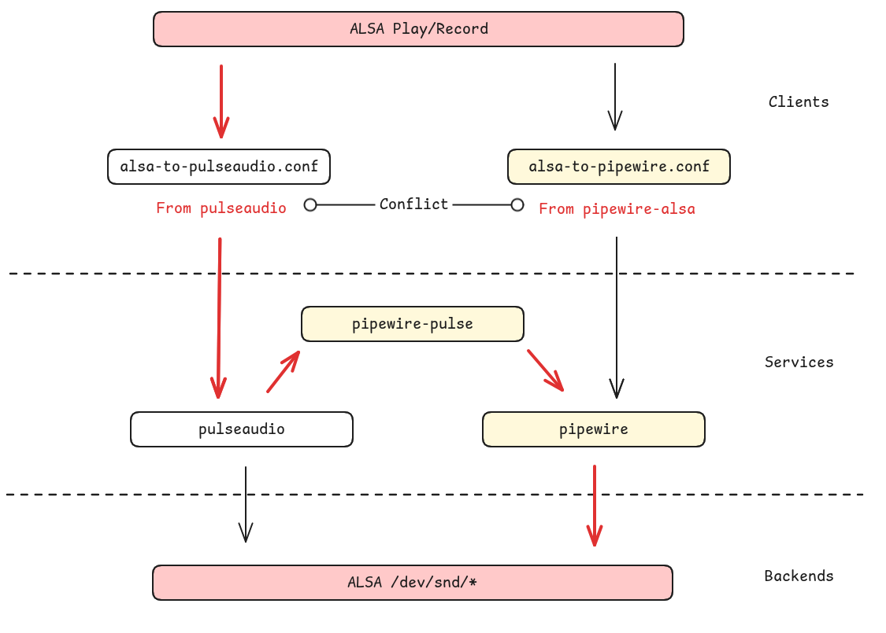

# alsa.conf

发现我们 deepin 系统的音频子系统存在拧巴的依赖关系。

## 接口

当前播放音乐有以下几个相对底层的接口：

- ALSA 接口
- PipeWire 接口
- PulseAudio 接口

其中，ALSA 可以通过「配置文件」默认将播放转发到 PulseAudio 或 PipeWire 接口。
PipeWire 提供了 PulseAudio 兼容接口，以 pipewire-pulse 包的形式存在：

```
$ apt-file list pipewire-pulse
pipewire-pulse: /usr/bin/pipewire-pulse
pipewire-pulse: /usr/lib/systemd/user/pipewire-pulse.service
pipewire-pulse: /usr/lib/systemd/user/pipewire-pulse.socket
pipewire-pulse: /usr/share/glib-2.0/schemas/org.freedesktop.pulseaudio.gschema.xml
pipewire-pulse: /usr/share/pipewire/pipewire-pulse.conf

$ ls -l /usr/bin/pipewire-pulse
lrwxrwxrwx 7 root root 8 2025年 7月 2日 /usr/bin/pipewire-pulse -> pipewire
```

在纯正的 PulseAudio 系统上，ALSA 接口由 PulseAudio 兼容

```
$ apt-file list pulseaudio | grep /etc/alsa/co
pulseaudio: /etc/alsa/conf.d/99-pulse.conf      <<< 设置 alsa 默认输出

$ cat /etc/alsa/conf.d/99-pulse.conf
# PulseAudio alsa plugin configuration file to set the pulseaudio plugin as
# default output for applications using alsa when pulseaudio is running.
hook_func.pulse_load_if_running {
    lib "libasound_module_conf_pulse.so"        <<< alsa-plugins 提供
    func "conf_pulse_hook_load_if_running"
}

@hooks [
    {
        func pulse_load_if_running
        files [
            "/usr/share/alsa/pulse-alsa.conf"   <<< pulseaudio 提供
        ]
        errors false
    }
]
```

如果 ALSA 库连不上 PulseAudio（没有运行、或没有权限）就 fallback 到默认物理声卡。

我们的 25 系统默认同时预装 PulseAudio 和 PipeWire，具体到包是：

- pulseaudio
- pipewire
- pipewire-pulse
- wirepulmber

在 Ubuntu 新系统上还有一个额外的 pipewire-alsa 提供 ALSA 的兼容

```
$ apt-file list pipewire-alsa
pipewire-alsa: /etc/alsa/conf.d/50-pipewire.conf
pipewire-alsa: /etc/alsa/conf.d/99-pipewire-default.conf    <<< 设置默认转发
pipewire-alsa: /usr/lib/x86_64-linux-gnu/alsa-lib/libasound_module_ctl_pipewire.so
pipewire-alsa: /usr/lib/x86_64-linux-gnu/alsa-lib/libasound_module_pcm_pipewire.so
pipewire-alsa: /usr/share/alsa/alsa.conf.d/50-pipewire.conf
pipewire-alsa: /usr/share/alsa/alsa.conf.d/99-pipewire-default.conf
```

但是我们没有（`pipewire-alsa` 与 `pulseaudio` 两包冲突），
所以此时系统里的 APP 如果调用了 ALSA 相关接口播放，那处理路径为：

1. ALSA 接口转发到 PulseAudio 接口
2. PulseAudio 接口由 PipeWire 兼容



ALSA 转发的配置文件来自 PulseAudio，缺少转发就会让客户端尝试直接打开 `/dev/snd`
设备，而这些节点一般被 PipeWire 和 WirePlumber 进程占据，无法正常播放。

```
$ aplay xxx.wav
ALSA lib pcm_dmix.c:1000:(snd_pcm_dmix_open) unable to open slave
aplay: main:850: audio open error: 设备或资源忙
```

## aplay

配置文件对当前系统最主要的功能是为 aplay 等提供 default 虚拟播放设备

```
$ aplay -L | grep -A 1 default
default
    Playback/recording through the PulseAudio sound server
```

例如安装 PulseAudio 时转发到 PA 的相关接口

```
$ strace -e openat aplay /usr/share/sounds/deepin/stereo/desktop-login.wav
openat(AT_FDCWD, "/etc/ld.so.cache", O_RDONLY|O_CLOEXEC) = 3
openat(AT_FDCWD, "/lib/x86_64-linux-gnu/libasound.so.2", O_RDONLY|O_CLOEXEC) = 3
openat(AT_FDCWD, "/lib/x86_64-linux-gnu/libc.so.6", O_RDONLY|O_CLOEXEC) = 3
openat(AT_FDCWD, "/lib/x86_64-linux-gnu/libm.so.6", O_RDONLY|O_CLOEXEC) = 3
openat(AT_FDCWD, "/usr/lib/locale/locale-archive", O_RDONLY|O_CLOEXEC) = 3
openat(AT_FDCWD, "/usr/share/alsa/alsa.conf", O_RDONLY) = 3
openat(AT_FDCWD, "/etc/alsa/conf.d", O_RDONLY|O_NONBLOCK|O_CLOEXEC|O_DIRECTORY) = 3
...
openat(AT_FDCWD, "/etc/alsa/conf.d/99-pulse.conf", O_RDONLY) = 3
...
openat(AT_FDCWD, "/lib/x86_64-linux-gnu/alsa-lib/libasound_module_conf_pulse.so", O_RDONLY|O_CLOEXEC) = 3
openat(AT_FDCWD, "/etc/ld.so.cache", O_RDONLY|O_CLOEXEC) = 3
openat(AT_FDCWD, "/lib/x86_64-linux-gnu/libpulse.so.0", O_RDONLY|O_CLOEXEC) = 3
```

## alsa-lib

配置文件的解析在 alsa-lib 库，宏定义文件入口 `/usr/share/alsa`。
`config_file_load` 函数中使用 `scandir64(alphasort64)`
按照按照序号依次扫描加载以 `.conf` 结尾的配置。

```
$ ls /etc/alsa/conf.d/
10-rate-lav.conf      50-oss.conf          60-vdownmix.conf
10-samplerate.conf    50-pulseaudio.conf   98-usb-stream.conf
10-speexrate.conf     60-a52-encoder.conf  99-pulseaudio-default.conf.example
50-arcam-av-ctl.conf  60-speex.conf        99-pulse.conf
50-jack.conf          60-upmix.conf
```

配置文件默认是 `+` merge + create，同样的标识符号还有
`-` merge、`?` 缺省默认、`!` 覆盖（常用来设置默认音频设备）。
`u` 排在 `i` 后面，所以 `99-pipe` 和 `99-pulse` 配置文件同时存在时后者会覆盖前者。

## pipewire-alsa

Debian 上游社区已经在 3 年前讨论过这个问题，此处的争执更多在语义完整性上：
当 PulseAudio 作为音频服务时，ALSA 被 PulseAudio 代理；
现在 PipeWire 接替了 PulseAudio，ALSA 应该被 PipeWire 直接代理还是因为兼容
PulseAudio 被兼容代理呢？

```
pipewire (0.3.60-1) unstable; urgency=medium

  * pipewire-alsa: conflict with pulseaudio. (Closes: #1013276)
      As long as the pulseaudio package is installed, ALSA clients will output
      via PulseAudio instead of PipeWire. This is due to the order of their
      respective configs files in /etc/alsa/conf.d/.

 -- Dylan Aïssi <daissi@debian.org>  Fri, 11 Nov 2022 14:55:34 +0100

pipewire (0.3.64-1) unstable; urgency=medium

  * pipewire-pulse: recommends pipewire-alsa
      When the pulseaudio package is installed, all sound are routed through
      pulseaudio. PipeWire should mimic this behavior by adding the recommend
      between pipewire-pulse and pipewire-alsa. Thus all sound are routed
      through pipewire.

 -- Dylan Aïssi <daissi@debian.org>  Tue, 17 Jan 2023 10:38:57 +0100

pipewire (0.3.64-3) experimental; urgency=medium

  * pipewire-pulse: do not recommend pipewire-alsa (Closes: #1029377)
  * Build a new metapackage pipewire-audio depending on recommended pipewire
      packages for a standard audio desktop use. Not knowing which packages
      to install is a common source of bug reports. This metapackage should
      help users to have a working configuration.

 -- Dylan Aïssi <daissi@debian.org>  Tue, 24 Jan 2023 10:43:23 +0100
```

- <https://bugs.debian.org/cgi-bin/bugreport.cgi?bug=1013276>
- <https://bugs.launchpad.net/ubuntu/+source/pipewire/+bug/1975823>
- <https://gitlab.freedesktop.org/pipewire/pipewire/-/issues/2255>
- <https://bugs.debian.org/cgi-bin/bugreport.cgi?bug=1029377>

## linyaps

测试时发现当前系统不装 pulseaudio 时 deepin-music 也正常工作，
咨询了玲珑组发现这里没怎么处理，运行时塞了一大堆东西进去。

```
$ ll-cli ps
应用              容器ID        进程ID
org.deepin.music  3149aa74d04a  7967
$ ll-cli enter org.deepin.music 
(18280) ./libs/linglong/src/linglong/cli/cli.cpp:870 select container id "3149aa74d04ae73312c289b838050ee5873bea05db2c1715b92ecd3f1b9deab7"
$ cd /etc/alsa/conf.d/
$ ls -al 99-pulse.conf
lrwxrwxrwx 1 nobody nogroup 38  7月  2  2025 99-pulse.conf -> /usr/share/alsa/alsa.conf.d/pulse.conf
$ dpkg -S 99-pulse.conf 
pulseaudio: /etc/alsa/conf.d/99-pulse.conf
```

因为配置文件转发在，绑定的 `/run/user/1000/pulse/` 套字节也在，所以很不好的正常运行了。

