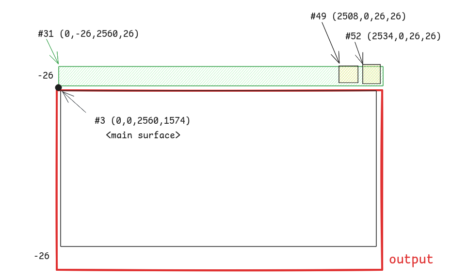

# Foot Size Debug

Foot 是一个备受推荐、「心智」完善的 Wayland 终端模拟器。
但是在 Cage 合成器上，一直有个底部间隙的问题：
[Black strip at the bottom · Issue #254 · cage-kiosk/cage](https://github.com/cage-kiosk/cage/issues/254)

## 环境

```
$ cage -- foot

$ cage -v
Cage version 0.2.1

$ foot --version
foot version: 1.25.0 +pgo +ime +graphemes -assertions
```

当前使用的显示器并未设置缩放，参数结果如 wlr-randr 所示：

```
DP-2 "YHY TYPE-C DXXXR499046S (DP-2)"
  Make: YHY
  Model: TYPE-C
  Serial: DXXXR499046S
  Physical size: 350x200 mm
  Enabled: yes
  Modes:
    2560x1600 px, 60.000000 Hz (preferred, current)
  Position: 0,0
  Transform: normal
  Scale: 1.000000
  Adaptive Sync: disabled
```

先启动一个无关紧要的 Cage 作为 base 环境避免退出，
查看 `XDG_RUNTIME_DIR` 发现有 `wayland-0`，拉起一个 foot 进程：

```
$ export WAYLAND_DEBUG=1
$ export WAYLAND_DISPLAY=wayland-0
$ foot > foot.log 2>&1
```

## 日志

```
[2696020.284] {Default Queue}  -> wl_display#1.get_registry(new id wl_registry#2)
[2696020.312] {Default Queue}  -> wl_display#1.sync(new id wl_callback#3)
[2696020.446] {Display Queue} wl_display#1.delete_id(3)
```

Client 的日志打印，`->` 是客户端的请求，其他是接收的事件。
为了方便把时间和 Quene 去掉，剩余的伪 FMT 如下：

```
{send ? " ->": ""}{interface->name}#{interface->id}.(args...)
```

> When a client deletes an object that it had created, the server will send this
> event to acknowledge that it has seen the delete request.

TODO 为什么在 callback done 的事件到达之前 callback id 就双删了？

```c
// src/wayland-client.c

WL_EXPORT struct wl_display *
wl_display_connect_to_fd(int fd)
{
    wl_map_init(&display->objects, WL_MAP_CLIENT_SIDE);
    wl_map_insert_at(&display->objects, 0, 0, NULL)         // id = 0
    display->proxy.object.id =
        wl_map_insert_new(&display->objects, 0, display);   // id = 1
```

在 `libwayland` 中，Client 侧 `wl_display` 全局对象的 id 始终默认为 1。

```
wl_registry#2.global(1, "wl_shm", 2)
  -> wl_registry#2.bind(1, "wl_shm", 2, new id [unknown]#4)
wl_registry#2.global(2, "zwp_linux_dmabuf_v1", 4)
wl_registry#2.global(3, "wl_compositor", 6)
  -> wl_registry#2.bind(3, "wl_compositor", 6, new id [unknown]#5)
wl_registry#2.global(4, "wl_subcompositor", 1)
  -> wl_registry#2.bind(4, "wl_subcompositor", 1, new id [unknown]#6)
...
wl_callback#3.done(197)       // 对应 .312 的 sync
  -> wl_display#1.sync(new id wl_callback#3)
wl_display#1.delete_id(3)
```

有了 `wl_display` 后可以起 `wl_registry` 对象进而注册其他对象（接口），
Client 这边有的绑了有的没绑。一般这里会阻塞一下确保 Server 消息处理、派发完毕。

> To mark the end of the initial burst of events, the client can use the
> `wl_display.sync request` immediately after calling `wl_display.get_registry`.

```
wl_display_roundtrip(wl_display)
    Block until all pending request are processed by the server

- wl_display_roundtrip_queue
- wl_display_sync               // sync 有点像 await
- wl_display_dispatch_queue
- wl_callback_destroy           // delete callback_id
```

到这里几个接口都绑好了，下面主要关注窗口相关的信息。

```
wl_output#17.geometry(0, 0, 350, 200, 0, "YHY", "TYPE-C", 0)
wl_output#17.mode(1, 2560, 1600, 60000)
wl_output#17.scale(1)
wl_output#17.name("DP-2")
wl_output#17.description("YHY TYPE-C DXXXR499046S (DP-2)")
wl_output#17.done()
```

屏幕缩放是 1 而且搜不到名字的杂牌，`wl_output` 是最好实现的 Wayland 接口。

```
  -> wl_compositor#5.create_surface(new id wl_surface#3)
  -> xdg_wm_base#12.get_xdg_surface(new id xdg_surface#24, wl_surface#3)
  -> xdg_surface#24.get_toplevel(new id xdg_toplevel#25)

  -> zxdg_decoration_manager_v1#13.get_toplevel_decoration(new id zxdg_toplevel_decoration_v1#26, xdg_toplevel#25)
  -> zxdg_toplevel_decoration_v1#26.set_mode(2)     // 客户端请求 SSD
  -> wl_surface#3.commit()

  -> wl_compositor#5.create_surface(new id wl_surface#27)
  -> wl_subcompositor#6.get_subsurface(new id wl_subsurface#28, wl_surface#27, wl_surface#3)
...
xdg_toplevel#25.configure(2560, 1600, array[4])
zxdg_toplevel_decoration_v1#26.configure(1)         // 合成器强制 CSD
xdg_surface#24.configure(198)
```

`wl_surface#3` 是主 surface 具有 toplevel，其下有若干 subsurface

- `wl_surface#3` aka `xdg_surface#24`, `xdg_toplevel#25`
  - `wl_surface#27` aka `wl_subsurface#28`
  - ...

```
  -> xdg_surface#24.ack_configure(198)              // ack
  -> xdg_toplevel#25.set_min_size(10, 49)
  -> xdg_surface#24.set_window_geometry(0, -26, 2560, 1600)
  -> wl_subsurface#31.set_position(0, -26)
  -> wl_subsurface#34.set_position(0, 0)
  -> wl_subsurface#49.set_position(2508, 0)
  -> wl_subsurface#52.set_position(2534, 0)
```

Wayland 客户端不知道自己的坐标，但是 subsurface 知道自己在父节点上的相对位置。

```
  -> wl_shm#4.create_pool(new id wl_shm_pool#54, fd 15, 282624)
  -> wl_shm_pool#54.create_buffer(new id wl_buffer#55, 0, 2560, 26, 10240, 0)
  -> wl_shm_pool#54.create_buffer(new id wl_buffer#56, 266240, 26, 26, 256, 0)
  -> wl_shm_pool#54.create_buffer(new id wl_buffer#57, 272896, 26, 26, 256, 0)
  -> wl_surface#48.attach(wl_buffer#56, 0, 0)
  -> wl_surface#48.damage_buffer(0, 0, 26, 26)
  -> wl_surface#48.commit()
```



```c
wl_shm_pool_create_buffer(
    pool,           // object
    offset,         // height * stride
    width,
    height,
    stride,         // align + width * bit
    WL_SHM_FORMAT
);
```

10240 / 2560 = 4，刚好 4 * 8 = 32 对应到 WHM 的颜色格式

| Argument | Value | Description |
|----------|-------|-------------|
| argb8888 |  0    | 32-bit ARGB format, [31:0] A:R:G:B 8:8:8:8 little endian |

下面的 26 26 大小需要 256 的 stride，这里涉及到对齐等其他设计
（TODO 为什么前面的就不需要）

- <https://learn.microsoft.com/en-us/windows/win32/medfound/image-stride>
- <https://t.me/icyzone/1509>

所以此处的间隙就是窗口顶部的标题栏，在 Cage 中窗口的位置尽量贴近显示器

```c
// view.c

static void
view_maximize(struct cg_view *view, struct wlr_box *layout_box)
{
	view->lx = layout_box->x;
	view->ly = layout_box->y;

	if (view->scene_tree) {
		wlr_scene_node_set_position(&view->scene_tree->node, view->lx, view->ly);
	}

	view->impl->maximize(view, layout_box->width, layout_box->height);
}
```

这里的 lx 和 ly 都是窗口在 output-layout 中的绝对坐标，没有考虑到后续窗口自身的
<https://wayland.app/protocols/xdg-shell#xdg_surface:request:set_window_geometry>

在 tinywl 中，可以看到可能更正常一点的排布（没有主动设置），因为默认自带偏移：

```c
// types/scene/xdg_shell.c

static void scene_xdg_surface_update_position(
		struct wlr_scene_xdg_surface *scene_xdg_surface) {
	struct wlr_xdg_surface *xdg_surface = scene_xdg_surface->xdg_surface;

	wlr_scene_node_set_position(&scene_xdg_surface->surface_tree->node,
		-xdg_surface->geometry.x, -xdg_surface->geometry.y);
```

`wlr_scene` 接口没什么能改的，还是 WM 自己看着办吧

```c
// types/scene/wlr_scene.c

void wlr_scene_node_set_position(struct wlr_scene_node *node, int x, int y) {
	if (node->x == x && node->y == y) {
		return;
	}

	node->x = x;
	node->y = y;
	scene_node_update(node, NULL);
}
```

测试时发现 Treeland 也有这个问题。
<https://github.com/linuxdeepin/treeland/issues/744>

