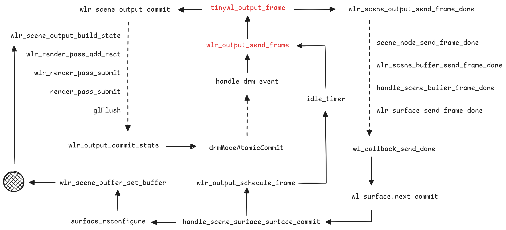

# TinyWL's Frame

一直想学习 wlroots 项目中的 scene 抽象，于是先从 output 的 frame 回调开始。
内容基于 0.19.0 版本的 wlroots 源码。

> Request a notification when it is a good time to start drawing a new frame,
> by creating a frame callback...

协议 `wl_surface:request:frame` 确保客户端绘制与显示器同步。
Tinywl 中 `output_frame` 函数绑定在 `wlr_output` 的 frame 信号上，
触发主要与后端有关，受到显示器的 page-flip 等帧率限制。
在**合适**的时间，合成器主动触发请求 frame 中的 `wl_callback` 回调 done，
提醒客户端可以准备下一帧。

> The frame request will take effect on the next `wl_surface.commit`.
>
> The `callback_data` passed in the callback is the current time...

发送一个不知何时开始的毫秒时间给客户端，想不出来除了时间还有什么其他影响。

在函数回复 done 之前的 `wlr_scene_output_commit` 在处理当前帧的数据状态，
`wlr_output_commit_state` 函数是我们在初始化 `wlr_output` 的 mode 时见过的老朋友。
经过接口 `wlr_output_impl` 和 `wlr_drm_interface` 的分发，
现代硬件很有可能走到了 `drmModeAtomicCommit` 的底层调用，
这个函数从内核绕了一圈，又会触发后端的 `drm_event` 产生一次 frame 事件。

TinyWL 对 `wl_surface:request:commit` 的监听约等于空，
可以认为是 scene 也监听了这个信号并在背后自动完成相关工作。

`wlr_output_schedule_frame` 和 `wlr_output_send_frame` 关系紧密，
一个偏业务另一个偏资源。大部分情况下应用窗口随显示器刷新不断收发：

- surface.commit
- request frame
- waiting about 1/60s
- callback.done
- surface.commit

但是应用窗口的 commit 可能不会触发 backend 的实际 commit 造成没有 frame 回调，
因此加入 schedule 以期在闲置时为应用程序有序刷新出 done。

待续 TODO

## Ref

- <https://gitlab.freedesktop.org/wlroots/wlroots/-/blob/0.19.0/tinywl/tinywl.c>
- <https://wayland.app/protocols/wayland#wl_surface:request:frame>
- <https://wayland.app/protocols/wayland#wl_surface:request:commit>

